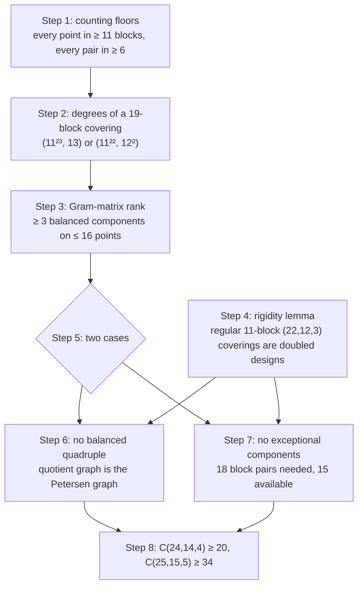

# The proof that C(24,14,4) ≥ 20

This is a human-readable account of the argument that the Lean development in
[`MAIN_PROOF/`](MAIN_PROOF/) formalizes. Each step links to the Lean declarations that
prove it.

> **Status.** AI agents wrote the mathematical argument and the Lean proof (see the
> [README](README.md)). This document is an edited version of the agents' own write-up, with
> standard terminology and more detail. Lean checks the formal proof; nobody has yet checked
> this prose against it line by line, and no mathematician has reviewed either. If something
> here is wrong or unclear, please open an issue.

## Contents

- [The statement](#the-statement)
- [Notation](#notation)
- [Outline](#outline)
- [Step 1. Counting floors](#step-1-counting-floors)
- [Step 2. Degrees and excess in a 19-block covering](#step-2-degrees-and-excess-in-a-19-block-covering)
- [Step 3. A rank bound forces balanced components](#step-3-a-rank-bound-forces-balanced-components)
- [Step 4. The rigidity lemma](#step-4-the-rigidity-lemma)
- [Step 5. Two cases](#step-5-two-cases)
- [Step 6. No balanced quadruple](#step-6-no-balanced-quadruple)
- [Step 7. No exceptional components](#step-7-no-exceptional-components)
- [Step 8. Conclusion](#step-8-conclusion)
- [Glossary of Lean names](#glossary-of-lean-names)
- [References](#references)

## The statement

A *$(v,k,t)$ covering* is a family of $k$-element subsets (*blocks*) of a $v$-element set such
that every $t$-element subset lies in at least one block. The *covering number*
$C(v,k,t)$ is the least number of blocks in a $(v,k,t)$ covering.

**Theorem.** $C(24,14,4) \ge 20$ and $C(25,15,5) \ge 34$.

The previous lower bounds were 19 and 32. The best known coverings have 23 and 42 blocks, so
neither number is determined.

In Lean, a family is a list of blocks, so the same block may appear more than once. Every
statement below holds in that generality: nothing in the argument assumes the blocks are
distinct. [`Challenge.lean`](Challenge.lean) states the theorem with Mathlib's `Finset`, and
[`IndependentCheck.lean`](IndependentCheck.lean) derives that form from the list form.

## Notation

Fix a family $\mathcal B$ of blocks on a point set $V$.

- The *degree* $d(x)$ of a point $x$ is the number of blocks containing $x$.
- The *codegree* $\lambda(x,y)$ of two points is the number of blocks containing both.
- If $\mathcal B$ is a $(v,k,t)$ covering and $x \in V$, the blocks through $x$, with $x$
  removed, form a $(v-1,k-1,t-1)$ covering of $V \setminus \{x\}$ with $d(x)$ blocks. This is
  the *derived covering* at $x$. Deriving twice, the blocks through two points $x,y$ form a
  $(v-2,k-2,t-2)$ covering with $\lambda(x,y)$ blocks.
- Two points are *twins* if they lie in exactly the same blocks.
- $I$ and $J$ are the identity and all-ones matrices, and $\mathbf 1$ is the all-ones vector.

Counting incidences of the derived covering gives the Schönheim bound
$C(v,k,t) \ge \lceil \tfrac{v}{k}\, C(v-1,k-1,t-1) \rceil$ [Sch64].

## Outline

The proof shows that no 19-block $(24,14,4)$ covering exists. Counting gives 19 as a lower
bound for free (Step 1), and also shows that a 19-block covering would be almost regular
(Step 2). A rank argument then finds some rigid structure in it (Step 3), which either
contains a *balanced quadruple* of points or has one exceptional shape (Step 5). Both cases
reduce to coverings of 22 points by 11 blocks, which Step 4 shows are completely rigid. That
rigidity contradicts both cases (Steps 6 and 7).

## Step 1. Counting floors

**Lemma 1.** $C(22,12,2) \ge 6$.

*Proof.* Suppose five 12-subsets of a 22-set $V$ cover every pair. They have 60
incidences, so some point $q$ has degree at most 2. A single block through $q$ meets only
11 of the 21 other points, so $q$ lies in exactly two blocks $A$ and $B$, and
$A \cup B = V$. Then $|A \cap B| = 2$, and $X = A \setminus B$ and $Y = B \setminus A$ have
10 points each.

The 100 pairs $\{x,y\}$ with $x \in X$, $y \in Y$ lie in neither $A$ nor $B$, so the other
three blocks cover them. A block with $a$ points of $X$ and $b$ points of $Y$ covers $ab$
such pairs, and $a + b \le 12$ gives $ab \le 36$. A block containing all of $X$ (or all of
$Y$) covers at most $10 \cdot 2 = 20$, so if one did, the three blocks would cover at most
$20 + 36 + 36 = 92 < 100$. So no block contains a whole side. Then each point of $X$ must lie
in at least two of the three blocks: a single block through it would have to contain all of
$Y$. The same holds for $Y$, so the three blocks need at least 40 incidences, but they have
only 36. $\square$

Deriving and counting incidences now gives $C(23,13,3) \ge \lceil 23 \cdot 6/13 \rceil = 11$
and $C(24,14,4) \ge \lceil 24 \cdot 11/14 \rceil = 19$. These are the previous lower bounds.

**Corollary 2.** In any $(24,14,4)$ covering, every point has degree at least 11 and every
pair has codegree at least 6.

*Proof.* The derived covering at a point is a $(23,13,3)$ covering, and at a pair it is a
$(22,12,2)$ covering. $\square$

Lean: [`no_five_pair_cover`](MAIN_PROOF/campaigns/async_goal/lean/recovered/PairLowerBoundRecoveredV4.lean#L44),
[`pair_cover_22_12_ge_six`](MAIN_PROOF/campaigns/async_goal/lean/recovered/PairLowerBoundRecoveredV4.lean#L131),
[`triple_cover_23_13_ge_eleven`](MAIN_PROOF/FormalResume20261003/PairFloorV1.lean#L32),
[`point_floor_eleven`](MAIN_PROOF/A19PhysicalFloors.lean#L11),
[`pair_floor_six`](MAIN_PROOF/FormalResume20261003/PairFloorV1.lean#L51).

**From here until Step 8, $\mathcal T$ is a $(24,14,4)$ covering of a 24-set $V$ by exactly
19 blocks.** The goal is a contradiction.

## Step 2. Degrees and excess in a 19-block covering

The 19 blocks have $19 \cdot 14 = 266 = 24 \cdot 11 + 2$ incidences, and every degree is at
least 11. So the degrees are either

- (a) one point of degree 13 and all others 11, or
- (b) two points of degree 12 and all others 11.

Call the degree-11 points *low* and the others *high*. Let $L$ be the set of low points, so
$|L| = 23$ or $22$.

For distinct points, let the *excess* be $w(x,y) = \lambda(x,y) - 6 \ge 0$. Each block
through $x$ contains 13 other points, so $\sum_{y \ne x} \lambda(x,y) = 13\, d(x)$, and

$$\sum_{y \ne x} w(x,y) = 13\, d(x) - 23 \cdot 6 = \begin{cases} 5 & d(x) = 11,\\ 18 & d(x) = 12,\\ 31 & d(x) = 13.\end{cases}$$

The *excess graph* $\Gamma$ has vertex set $L$, with an edge of weight $w(x,y)$ between low
points whenever $w(x,y) > 0$. Write $\delta(x) = \sum_{y \in L} w(x,y)$ for the weighted
degree of $x$ in $\Gamma$; it is at most 5.

Lean: [`degree_patterns`](MAIN_PROOF/A19PhysicalCounts.lean#L30),
[`fullExcess_row_sum`](MAIN_PROOF/A19PhysicalCounts.lean#L72),
[`lowExcess_row_le_five`](MAIN_PROOF/A19PhysicalCounts.lean#L98).

## Step 3. A rank bound forces balanced components

Call a connected component $K$ of $\Gamma$ *balanced* if it is bipartite, with sides of equal
size, and every vertex of $K$ has $\delta = 5$.

**Lemma 3.** In a 19-block $(24,14,4)$ covering:

1. there are at least $|L| - 19$ balanced components, so at least 3, and at least 4 in
   case (a);
2. every block contains equally many points from the two sides of each balanced component;
3. a point $x$ of a balanced component has $\lambda(x,y) = 6$ for every point $y$ outside it,
   including the high points, and for every $y$ on the same side;
4. the balanced components cover at most 16 points;
5. each balanced component has even size, and a balanced component of size 2 is a pair of
   twins.

*Proof.* Let $M$ be the $L \times 19$ incidence matrix of low points against blocks and
$G = MM^{\mathsf T}$ its Gram matrix. Its diagonal entries are 11 and its off-diagonal entries
are $\lambda(x,y) = 6 + w(x,y)$, so

$$G = 5I + 6J + W,$$

where $W$ is the weighted adjacency matrix of $\Gamma$. For any real vector $z$ on $L$,

$$z^{\mathsf T}(5I + W)z = \sum_{x} \bigl(5 - \delta(x)\bigr) z_x^2 + \sum_{\{x,y\}} w(x,y)\,(z_x + z_y)^2 .$$

Both sums are nonnegative, so $5I + W$ is positive semidefinite, and $z$ is in its kernel
exactly when $z_x = 0$ wherever $\delta(x) < 5$ and $z_y = -z_x$ along every edge. So kernel
vectors live on bipartite components whose vertices all have $\delta = 5$, with opposite
signs on the two sides. In such a component the total edge weight is $5|K^+| = 5|K^-|$, so the
sides have equal size: these are exactly the balanced components. The kernel of $5I + W$ is
spanned by their alternating vectors ($+1$ on one side, $-1$ on the other).

An alternating vector sums to zero, so $Jz = 0$ and it is also in the kernel of $G$.
Conversely, $z^{\mathsf T} G z = z^{\mathsf T}(5I + W) z + 6\,(\mathbf 1^{\mathsf T} z)^2$, so
$Gz = 0$ forces $z$ into the kernel of $5I + W$. Hence the nullity of $G$ is the number of
balanced components. Since $G = MM^{\mathsf T}$ has rank at most 19, there are at least
$|L| - 19$ of them. This is part 1.

For an alternating vector $z$, $\lVert M^{\mathsf T} z\rVert^2 = z^{\mathsf T} G z = 0$, so
every block meets the two sides equally. This is part 2.

A vertex of a balanced component has $\delta(x) = 5$, which is its entire excess, so it has no
excess to high points or to low points outside its component. It has none to its own side
either, because the component is bipartite. This is part 3.

For part 4, let $U$ be the union of the balanced components. By part 3 no high point has
excess to $U$, and each low point has total excess 5. In case (a), the degree-13 point has
excess 31, all of it to low points outside $U$, at most 5 each; so at least 7 low points lie
outside $U$, and $|U| \le 23 - 7 = 16$. In case (b), the two degree-12 points $h_1, h_2$ have
excess 18 each and $w(h_1,h_2) \le 12 - 6 = 6$, so together they send at least
$36 - 12 = 24$ excess to low points outside $U$. Each low point absorbs at most 5, so at
least 5 low points lie outside $U$, and $|U| \le 17$. Since $|U|$ is even (part 5),
$|U| \le 16$.

For part 5, the sides have equal size, so the size is even. In a size-2 component
$\{x,x'\}$ the edge has weight 5, so $\lambda(x,x') = 11 = d(x) = d(x')$, and $x$ and $x'$ lie
in the same blocks. $\square$

Lean: [`low_gram_identity`](MAIN_PROOF/A19WeightedFrontend.lean#L26),
[`energy_identity`](MAIN_PROOF/WeightedSignlessKernel.lean#L30),
[`nullity_eq_balanced_bipartite_components`](MAIN_PROOF/WeightedKernelClassification.lean#L87),
[`component_count_from_physical`](MAIN_PROOF/A19WeightedFrontend.lean#L42),
[`at_least_three_components`](MAIN_PROOF/A19WeightedFrontend.lean#L50),
[`at_least_four_components_of_one_high`](MAIN_PROOF/A19WeightedFrontend.lean#L57),
[`component_slot_balance`](MAIN_PROOF/A19PhysicalBalance.lean#L12),
[`component_closed_in_all_points`](MAIN_PROOF/A19WeightedFrontend.lean#L79),
[`good_vertices_le_sixteen`](MAIN_PROOF/A19ComponentUnion.lean#L127),
[`component_size_even`](MAIN_PROOF/WeightedComponentSupports.lean#L43).

## Step 4. The rigidity lemma

Both remaining cases lead to an 11-block covering of 22 points. This lemma shows such a
covering, if regular, has a unique shape: a *doubled* symmetric design, in which every point
has a twin.

**Lemma 4 (rigidity).** Let $\mathcal F$ be 11 blocks of size 12 on a 22-set $Y$ that cover
every triple, with every point of degree 6. Then there is a fixed-point-free involution
$\sigma$ of $Y$ such that

- $y$ and $\sigma(y)$ are twins, so $\lambda(y,\sigma(y)) = 6$;
- $\lambda(y,z) = 3$ whenever $z \notin \{y, \sigma(y)\}$.

Collapsing each twin pair to a point gives a symmetric $2$-$(11,6,3)$ design. Consequently,
two distinct blocks of $\mathcal F$ share exactly 6 points, the incidence matrix of
$\mathcal F$ has rank 11, and every real vector $z$ on $Y$ that sums to zero on each block
satisfies $z(\sigma(y)) = -z(y)$.

*Proof.* Every codegree is at least 2: the blocks through $x$ and $y$, with $x,y$ removed,
are 10-sets covering the other 20 points. If $\lambda(x,y) = 2$, those two 10-sets partition
the other 20 points, so the two blocks through $x$ and $y$ have union $Y$ and intersection
$\{x,y\}$.

*Codegree-2 pairs form a matching.* Suppose $\lambda(u,v) = \lambda(u,w) = 2$ with
$v \ne w$. The two blocks through $u,v$ and the two through $u,w$ share a block $A$ (they
cannot share both, since two blocks with union $Y$ meet in only two points). Let $B$ and $C$
be the others. Then $A \supseteq \{u,v,w\}$, and with $Y' = Y \setminus A$ (10 points) and
$Z = A \setminus \{u,v,w\}$ (9 points) we have $B = \{u,v\} \cup Y'$ and
$C = \{u,w\} \cup Y'$. The other three blocks through $u$ avoid $v$ and $w$, and they must
cover all 90 triples $\{u,y,z\}$ with $y \in Y'$, $z \in Z$. Each has 11 points besides $u$,
so it covers at most $\lfloor 11^2/4 \rfloor = 30$ of the pairs $\{y,z\}$. All three must
attain 30, splitting 5/6 between $Y'$ and $Z$. Then no block contains a whole side, so every
point of $Y' \cup Z$ needs two of these blocks: 38 incidences, but only 33 are available.

*Codegrees are 3 or 4 off the matching.* Let $\{x,y\}$ be a codegree-2 pair. Besides the two
common blocks, $x$ and $y$ each lie in 4 more blocks, all different, which uses 8 of the
other 9 blocks; call the remaining one $N$. Any other point $z$ is in exactly one of the two
common blocks and in 5 of the other 9, so

$$\lambda(x,z) + \lambda(y,z) = 7 - [z \in N].$$

Since $z$ is not matched to $x$ or $y$, both terms are at least 3, so each is 3 or 4.

*No codegree-2 pairs at all.* Let $M$ be the $22 \times 11$ incidence matrix, and let $W$
have off-diagonal entries $\lambda(x,y) - 3$ and zero diagonal, so
$MM^{\mathsf T} = 3I + 3J + W$. Each row of $W$ sums to $66 - 63 = 3$. A matched point has
row entries $-1$ (its partner) and otherwise 0 or 1, so its row has four entries 1 and squared
sum 5. An unmatched point has nonnegative entries summing to 3, so its squared sum is at most
9.

Let $K = MM^{\mathsf T} - 3J = 3I + W$. Since $MM^{\mathsf T}\mathbf 1 = 72\,\mathbf 1$, the
matrix $K$ has the eigenvector $\mathbf 1$ with eigenvalue 6 and agrees with $MM^{\mathsf T}$
on $\mathbf 1^\perp$. So $K$ is positive semidefinite with rank at most 11 and trace 66. By
Cauchy–Schwarz on its eigenvalues,
$\operatorname{tr}(K^2) \ge 66^2/11 = 396$. But
$\operatorname{tr}(K^2) = 22 \cdot 9 + \sum_{x \ne y} W_{xy}^2$, so the squared row sums of
$W$ total at least 198. With $f$ matching edges they total at most $198 - 8f$. So $f = 0$,
and every row of $W$ has squared sum exactly 9: one entry 3 and the rest 0. The entry 3 marks
a partner $\sigma(y)$ with $\lambda = 6$, a twin, and all other codegrees are 3.

*Consequences.* Collapsing twin pairs gives 11 blocks of 6 classes on 11 classes, with
every two classes in 3 common blocks: a symmetric $2$-$(11,6,3)$ design. Its incidence
matrix $N$ satisfies $N^{\mathsf T} N = 3I + 3J$, which is invertible, so it has rank 11, and
in a symmetric design two blocks share $\lambda = 3$ classes, which is 6 points. If $z$ sums
to zero on each block, then $\bar z(c) = z(y) + z(\sigma(y))$ is a vector on classes that
sums to zero on each block of the quotient, so $\bar z = 0$ by invertibility. $\square$

Lean: [`codegree_two_matching`](MAIN_PROOF/FormalResume20261003/Regular22MatchingV1.lean#L98),
[`no_three_rows`](MAIN_PROOF/FormalResume20261003/MatchingGridV1.lean#L93),
[`trace_square_ge_396`](MAIN_PROOF/MatrixFoundation.lean#L41),
[`regular22_physical_twins`](MAIN_PROOF/Regular22PhysicalRigidity.lean#L112),
[`regular22_twins_with_balance`](MAIN_PROOF/Regular22TwinBalance.lean#L55),
[`regular22_row_intersection_six`](MAIN_PROOF/Regular22RowGram.lean#L68),
[`physical_full_column_rank`](MAIN_PROOF/Regular22RankConsequences.lean#L23).

**Corollary 5 (20-point completions).** Let $X$ be a 20-set, $\mathcal H$ six 10-subsets of
$X$ covering every pair, and $\mathcal E$ five 12-subsets in which every point has degree 3,
such that $\mathcal H \cup \mathcal E$ covers every triple. Then:

1. every point has degree 3 in $\mathcal H$;
2. there is a fixed-point-free involution $\sigma$ of $X$ whose pairs are twins in both
   $\mathcal H$ and $\mathcal E$;
3. two blocks of $\mathcal H$ share exactly 4 points;
4. for $y \notin \{x,\sigma(x)\}$, $\lambda_{\mathcal H}(x,y) + \lambda_{\mathcal E}(x,y) = 3$
   and $\lambda_{\mathcal H}(x,y) \le 2$;
5. $\sigma$ is determined by $\mathcal H$ alone: $\sigma(x)$ is the only other point that
   lies in all three $\mathcal H$-blocks through $x$.

*Proof.* Two 10-sets through $x$ reach at most 18 other points, so pair coverage needs 3,
and 60 incidences make every degree exactly 3. Add two new points to every block of
$\mathcal H$. The result, together with $\mathcal E$, is 11 blocks of size 12 on 22 points
with every degree 6, and it covers every triple: triples inside $X$ by assumption, and
triples through a new point because $\mathcal H$ covers pairs. Lemma 4 applies. The two new
points are twins of each other, so $\sigma$ restricts to $X$, and parts 2–4 follow from
Lemma 4 (blocks share 6 points, 2 of them new). If $\lambda_{\mathcal H}(x,y) = 3$ for a
non-twin $y$, then $\lambda_{\mathcal E}(x,y) = 0$, and $x$ and $y$ would need disjoint
triples of the five $\mathcal E$-blocks, which is impossible. That gives the bound in part 4
and part 5. $\square$

Part 5 matters below: two completions $\mathcal E$ and $\mathcal F$ of the same $\mathcal H$
give the same pairing.

Lean: [`Completion`](MAIN_PROOF/Regular20Extension.lean#L11),
[`old_twin_geometry`](MAIN_PROOF/Regular20Twins.lean#L33),
[`H_signature_characterizes`](MAIN_PROOF/Regular20Twins.lean#L96),
[`completions_share_pairing`](MAIN_PROOF/Regular20Twins.lean#L113),
[`nonpartner_H_codegree`](MAIN_PROOF/Regular20Twins.lean#L120),
[`H_row_intersection_four`](MAIN_PROOF/Regular20RowIntersections.lean#L35).

## Step 5. Two cases

**Definition.** A *balanced quadruple* is a set of four distinct low points $u,v,s,t$ with

- $\lambda(u,v) = 6$;
- $[u \in B] + [v \in B] = [s \in B] + [t \in B]$ for every block $B$;
- $\lambda(u,x) = \lambda(v,x) = 6$ for every other point $x$.

**Lemma 6.** Either $\mathcal T$ has a balanced quadruple, or we are in case (b) and the
balanced components have sizes exactly $\{2,6,6\}$ or $\{2,6,8\}$.

*Proof.* A balanced component of size 4 has sides $\{u,v\}$ and $\{s,t\}$; Lemma 3 gives the
three conditions with $\lambda(u,v) = 6$ because $u,v$ are on the same side. Two balanced
components of size 2, $\{u,s\}$ and $\{v,t\}$, are twin pairs, and again Lemma 3 gives the
conditions. Otherwise every component has size 2 or at least 6, with at most one of size 2.
By Lemma 3 there are at least 3 components on at most 16 points, so the sizes are
$\{2,6,6\}$ or $\{2,6,8\}$. Case (a) would need four components, at least
$2 + 6 + 6 + 6 = 20$ points. $\square$

Lean: [`GadgetData`](MAIN_PROOF/A19GadgetInterface.lean#L14),
[`has_gadget_of_four_component`](MAIN_PROOF/A19GadgetInterface.lean#L86),
[`has_gadget_of_two_two_components`](MAIN_PROOF/A19TwoTwinGadget.lean#L52),
[`classify`](MAIN_PROOF/ComponentOrderDichotomy.lean#L12),
[`ExceptionalComponents`](MAIN_PROOF/A19ComponentDichotomy.lean#L14),
[`gadget_or_exceptional_components`](MAIN_PROOF/A19ComponentDichotomy.lean#L28).

## Step 6. No balanced quadruple

**Proposition 7.** A 19-block $(24,14,4)$ covering has no balanced quadruple.

*Proof.* Suppose $u,v,s,t$ is one, and let $X$ be the other 20 points. Sort the 19 blocks:

| Family | Blocks containing | Count | Gadget points | Size on $X$ |
|---|---|---|---|---|
| $\mathcal H$ | $u$ and $v$ | $\lambda(u,v) = 6$ | all four | 10 |
| $\mathcal E$ | $u$, not $v$ | $11 - 6 = 5$ | $u$ and one of $s,t$ | 12 |
| $\mathcal F$ | $v$, not $u$ | 5 | $v$ and one of $s,t$ | 12 |
| $\mathcal G$ | neither | 3 | none | 14 |

The gadget-point column follows from the balance condition. On $X$, $\mathcal H$ covers every
pair (the 4-set $\{u,v,x,y\}$ needs a block through $u$ and $v$), and
$\mathcal H \cup \mathcal E$ and $\mathcal H \cup \mathcal F$ each cover every triple (look at
$\{u,x,y,z\}$ and $\{v,x,y,z\}$). By Corollary 5 every $x \in X$ has
$d_{\mathcal H}(x) = 3$, so $d_{\mathcal E}(x) = \lambda(u,x) - 3 = 3$, and likewise
$d_{\mathcal F}(x) = 3$. So $(\mathcal H, \mathcal E)$ and $(\mathcal H, \mathcal F)$ are
both completions, and by part 5 of Corollary 5 they share one pairing $\sigma$ of $X$ into
ten twin classes.

*The quotient graph.* Let $C$ be the $6 \times 10$ incidence matrix of $\mathcal H$ against
twin classes. Rows have 5 ones, columns have 3, and two rows share 2 classes, so
$CC^{\mathsf T} = 3I + 2J$. The off-diagonal entries of $C^{\mathsf T}C$ are class codegrees
in $\mathcal H$, which are 1 or 2 (at least 1 because $\mathcal H$ covers pairs). Let $A$ be
the 0/1 matrix marking codegree 2, so $C^{\mathsf T}C = 2I + J + A$. Then

$$(C^{\mathsf T}C)^2 = C^{\mathsf T}(3I + 2J)C = 3\,C^{\mathsf T}C + 18J,$$

using $\mathbf 1^{\mathsf T}C = 3\,\mathbf 1^{\mathsf T}$. Row sums of $C^{\mathsf T}C$ are
$3 \cdot 5 = 15$, so $A\mathbf 1 = 3\,\mathbf 1$. Expanding the square then gives

$$A^2 + A - 2I = J.$$

So the graph with adjacency matrix $A$ is 3-regular on 10 vertices, adjacent vertices have no
common neighbour, and non-adjacent vertices have exactly one. (This is the Petersen graph,
though the argument never needs that.)

*Removing two vertices leaves it connected.* Let $D$ be a set of at most 2 vertices, and
suppose the graph minus $D$ is disconnected. Fix a remaining vertex $z$. A remaining vertex
$x$ outside $z$'s component is not adjacent to $z$, so they have exactly one common
neighbour, and it lies in $D$ (otherwise it would join the two components). A vertex of $D$
adjacent to $z$ has only two other neighbours, so at most $2|D|$ remaining vertices lie
outside $z$'s component. So every component contains all but at most $2|D|$ of the
$10 - |D|$ remaining vertices. If $|D| \le 1$, two components would each have at least 7
vertices, which is too many. If $|D| = 2$, there are exactly two components of 4 vertices
each, and the count is tight only if every remaining vertex is adjacent to both vertices of
$D$. Then the vertices of $D$ have degree 8, not 3.

*Colours.* Every $x \in X$ has degree $9 + d_{\mathcal G}(x) \ge 11$, so
$d_{\mathcal G}(x) \ge 2$. The three $\mathcal G$-blocks have 42 incidences on 20 points, so
exactly two points $a,b$ have $d_{\mathcal G} = 3$ and the other 18 have $d_{\mathcal G} = 2$.
Each of those 18 misses exactly one $\mathcal G$-block; call that block its *colour*. A
$\mathcal G$-block misses exactly 6 points of $X$, so each colour has at most 6 points.

*Edges force equal colours.* If classes $i,j$ are adjacent, then for any $x$ in $i$ and $y$
in $j$, $\lambda_{\mathcal H}(x,y) = 2$ and $\lambda_{\mathcal E}(x,y) =
\lambda_{\mathcal F}(x,y) = 3 - 2 = 1$ by Corollary 5. Since $\lambda(x,y) \ge 6$, the two
points share at least 2 $\mathcal G$-blocks. If both have $d_{\mathcal G} = 2$, they are in the
same two blocks and have the same colour.

*Contradiction.* Delete the at most two classes containing $a$ or $b$. The remaining classes
(at least 8) induce a connected graph, every remaining class has a neighbour, and all their
points (at least 16) have $d_{\mathcal G} = 2$. Colours agree along every edge, for both points
of each class, so all of these points share one colour. But a colour has at most 6
points. $\square$

Lean: [`actual_completions`](MAIN_PROOF/GadgetPhysicalTraces.lean#L172),
[`quotient_row_gram`](MAIN_PROOF/PhysicalQuotientMatrix.lean#L83),
[`Data`](MAIN_PROOF/QuotientMatrixGraph.lean#L19),
[`adjacency_polynomial`](MAIN_PROOF/QuotientMatrixGraph.lean#L85),
[`adjacent_common_empty`](MAIN_PROOF/QuotientMatrixGraph.lean#L181),
[`nonadjacent_unique_common`](MAIN_PROOF/QuotientMatrixGraph.lean#L194),
[`cubic_ten_connected_delete_le_two`](MAIN_PROOF/SmallCutConnectivity.lean#L125),
[`two_high_points`](MAIN_PROOF/GadgetResidualColors.lean#L79),
[`color_fiber_capacity`](MAIN_PROOF/GadgetResidualColors.lean#L144),
[`residual_pair_floor`](MAIN_PROOF/GadgetPairGeometry.lean#L24),
[`physical_color_capacity_impossible`](MAIN_PROOF/HighPointDeletion.lean#L94),
[`gadget_impossible`](MAIN_PROOF/GadgetExclusion.lean#L21).

## Step 7. No exceptional components

**Proposition 8.** A 19-block $(24,14,4)$ covering in case (b) cannot have balanced
components of sizes $\{2,6,6\}$ or $\{2,6,8\}$.

*Proof.* Let $h_1,h_2$ be the high points and $\{q,q'\}$ the size-2 component, a twin pair.
Let $\mathcal P$ be the 11 blocks through $q$ (and $q'$), let $\mathcal R$ be the other 8,
and let $Y$ be the other 22 points.

*The providers are rigid.* On $Y$, $\mathcal P$ consists of 11 blocks of size 12 covering
every triple (look at $\{q,x,y,z\}$). By Lemma 3, $\lambda(q,y) = 6$ for every $y \in Y$, so
every point of $Y$ has degree 6 in $\mathcal P$. Lemma 4 gives a twin involution $\sigma$ of
$Y$ with $\lambda_{\mathcal P} = 3$ off the twin pairs. In $\mathcal R$, low points of $Y$
have degree $11 - 6 = 5$ and $h_1,h_2$ have degree $12 - 6 = 6$.

*Components split twin pairs.* Let $K$ be one of the two larger components, with alternating
vector $z$. By Lemma 3, $z$ sums to zero on every block, in particular on every block of
$\mathcal P$, so Lemma 4 gives $z(\sigma(y)) = -z(y)$. Hence $\sigma$ maps each side of $K$
onto the other.

*Selected points.* Let $S$ be one side of the size-6 component together with one side of the
other large component: 6 or 7 low points, no two of them twins. For distinct $x,y \in S$,
$\lambda(x,y) = 6$ by Lemma 3 and $\lambda_{\mathcal P}(x,y) = 3$, so
$\lambda_{\mathcal R}(x,y) = 3$. For $x \in S$, likewise $\lambda(x,h_1) = 6$ and
$\lambda_{\mathcal P}(x,h_1) = 3$ (the twin of $x$ is a low point on the other side), so
$\lambda_{\mathcal R}(x,h_1) = 3$.

*Counting in $\mathcal R$.* For $x \in S$ let $O(x)$ be the 3 blocks of $\mathcal R$ missing
$x$, and let $O(h_1)$ be the 2 missing $h_1$. Inclusion–exclusion in the 8 blocks gives

$$|O(x) \cap O(y)| = 8 - (5 + 5 - 3) = 1, \qquad |O(x) \cap O(h_1)| = 8 - (5 + 6 - 3) = 0.$$

So at least six triples $O(x)$ lie inside the 6 blocks outside $O(h_1)$, and any two share
exactly one block. Each triple contains 3 pairs of blocks, and no pair is in two triples, so
they need at least 18 different pairs. A 6-set has only 15. $\square$

Lean: [`twin_frame_of_exception`](MAIN_PROOF/TwinProviderTrace.lean#L155),
[`provider_side_of_component`](MAIN_PROOF/ProviderSides.lean#L27),
[`eight_slot_obstruction`](MAIN_PROOF/OmissionSlotCounting.lean#L79),
[`no_six_omission_triples`](MAIN_PROOF/FormalResume20261003/SixPointTriplesV1.lean#L150),
[`balanced_sides_obstruction`](MAIN_PROOF/BalancedSidesObstruction.lean#L36),
[`exception_impossible`](MAIN_PROOF/PhysicalExceptionExclusion.lean#L25),
[`physical_has_gadget`](MAIN_PROOF/PhysicalExceptionExclusion.lean#L140).

## Step 8. Conclusion

By Lemma 6, a 19-block $(24,14,4)$ covering has a balanced quadruple or exceptional
components, and Propositions 7 and 8 rule out both. So no covering has exactly 19 blocks. A
covering with fewer blocks can be padded to 19 by repeating a block, and nothing above
assumed distinct blocks, so that is impossible too. Hence

$$C(24,14,4) \ge 20.$$

For $C(25,15,5)$: the derived covering at any point of a $(25,15,5)$ covering is a
$(24,14,4)$ covering, so every point has degree at least 20, and $15b \ge 25 \cdot 20$ gives
$b \ge 34$.

Lean: [`exact_nineteen_excluded`](MAIN_PROOF/FinalCoveringBounds.lean#L16),
[`no_at_most_nineteen`](MAIN_PROOF/FinalLowerBoundWrappers.lean#L41),
[`c24_14_4_lower_twenty`](MAIN_PROOF/FinalCoveringBounds.lean#L21),
[`point_degree_twenty_of_c24`](MAIN_PROOF/FinalLowerBoundWrappers.lean#L55),
[`c25_15_5_lower_thirty_four`](MAIN_PROOF/FinalCoveringBounds.lean#L25).

The same Schönheim step also raises the tabulated lower bounds for $C(26,16,6)$ from 52 to 56,
$C(27,17,7)$ from 83 to 89 and $C(28,18,8)$ from 130 to 139. These are not formalized here.

## Glossary of Lean names

The Lean proof keeps the names the agents gave things during the campaign. This table
translates them.

| Lean name | Meaning here |
|---|---|
| `A19…`, `exact_nineteen…` | a hypothetical 19-block $(24,14,4)$ covering |
| `Physical…`, "physical" | about the actual family of blocks, not an abstracted model |
| `slot`, `row` | a block (one list entry; blocks may repeat) |
| `degree`, `pairDegree` | $d(x)$ and $\lambda(x,y)$ |
| `LowPoint` | a point of degree 11 |
| `fullExcess`, `lowExcess` | the excess $w(x,y) = \lambda(x,y) - 6$ |
| `lowSystem`, `WeightedKernelComponents.System` | the excess graph $\Gamma$ with its weights |
| `BalancedBipartite`, `goodComponents`, `goodVertices` | balanced components and their union |
| `GadgetData`, `HasGadget`, "gadget" | a balanced quadruple |
| `ExceptionalComponents`, "exception" | components of sizes $\{2,6,6\}$ or $\{2,6,8\}$ |
| `Regular22…`, "regular22" | an 11-block regular $(22,12,3)$ covering, as in Lemma 4 |
| `Regular20…`, `Completion H E` | a 20-point completion, as in Corollary 5 |
| `H`, `E`, `F`, `G` | the families $\mathcal H, \mathcal E, \mathcal F, \mathcal G$ of Step 6 |
| `color` | the colour of Step 6 |
| `TwinFrame`, `providers`, `remainder` | $\{q,q'\}$, $\mathcal P$ and $\mathcal R$ of Step 7 |
| `missing`, "omission" | $O(x)$ in Step 7 |
| `PairLowerBound…`, `CrossGrid…`, `MatchingGrid` | the capacity counts in Lemmas 1 and 4 |
| `NormalizedBridge20261003`, `FormalResume20261003/`, `rounds/`, `campaigns/` | campaign dates and folders, no mathematical meaning |

## References

- [Sch64] J. Schönheim, "[On coverings](https://doi.org/10.2140/pjm.1964.14.1405)",
  *Pacific J. Math.* **14** (1964), 1405–1411.
- [Mil79] W. H. Mills, "Covering designs I: coverings by a small number of subsets",
  *Ars Combin.* **8** (1979), 199–315.
- [LJCR] D. M. Gordon, [La Jolla Covering Repository](https://dmgordon.org/covering-designs/).
