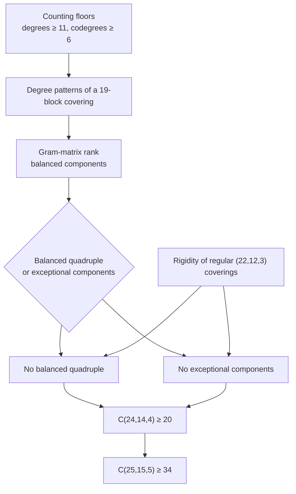

# A Lean proof that C(24,14,4) ≥ 20

Suppose a lottery draws 4 numbers out of 24, and each ticket lets you pick 14 numbers. How
many tickets do you need so that, whatever is drawn, one of your tickets contains all four
numbers?

The best known answer is 23 tickets. For decades, the best proven lower bound has been 19.
This repository contains a Lean proof that you need at least **20**.

In the language of combinatorics: a *(v, k, t) covering design* is a family of k-element
subsets (*blocks*) of a v-element set such that every t-element subset lies in at least one
block. The *covering number* C(v, k, t) is the smallest possible number of blocks.

| | Previous lower bound | New lower bound | Best known covering |
|---|---|---|---|
| C(24,14,4) | 19 | **20** | 23 |
| C(25,15,5) | 32 | **34** | 42 |

The second bound follows from the first by the Schönheim bound: ⌈25 · 20 / 15⌉ = 34.
Applying it further also improves C(26,16,6) to 56, C(27,17,7) to 89 and C(28,18,8) to 139.
Those three are not formalized here.

I believe this repository contains a [proof](MAIN_PROOF/FinalCoveringBounds.lean) of both
bounds. You can read it [as mathematics](PROOF.md) or explore it on the
[companion site](https://jamesyc.com/covering/).

## About this proof

This proof grew out of an AI research campaign that I ran in OpenAI Dots on 1–3 October 2026. The team consisted of seven agents: one coordinating dot and six Astra research subagents. The agents developed the mathematical arguments and wrote the Lean proofs. I chose the problem, directed the research, questioned the approach, and helped decide what to pursue next.

The original target was C(25,15,5): can 41 blocks of size 15 cover every five-element subset of a 25-point set? A 42-block construction is known, but we have not settled whether 41 blocks suffice. The campaign explored both possibilities: searching for a construction and deriving restrictions that any smaller covering would have to satisfy.

The result in this repository emerged as an intermediate lemma. Following the lower-bound route led the agents to the question of whether 19 blocks of size 14 could cover every four-element subset of 24 points. They found a contradiction, establishing C(24,14,4) ≥ 20. The Schönheim bound then gives C(25,15,5) ≥ 34.

### How the agents worked

The work was divided among mathematical research, Lean formalization, construction and computational search, adversarial review, and coordination. Different agents pursued different approaches, exchanged intermediate results, and checked one another’s arguments. A promising argument could be sent to another agent to look for missing assumptions or counterexamples, while a formalizer worked on translating it into Lean.

The mathematics made the problem smaller before computation entered the picture. Counting bounds restricted point degrees and pair incidences. Gram-matrix and rank arguments forced additional structure. Rigidity results reduced the remaining possibilities to configurations that could be excluded by further counting arguments. The proof in this repository records the resulting chain of deductions; [PROOF.md](PROOF.md) presents that chain in more conventional mathematical language.

The distinction between a plausible argument and a verified theorem mattered throughout. An agent’s successful build was tracked separately from an independent rebuild. Review also had to check that the formal statement described an actual covering design, and that intermediate lemmas applied to the same blocks and points used by the final theorem. The verification section below describes the checks on the published result.

### Current research strategy

The campaign is continuing beyond this proof, with the main effort now directed at the possibility of a 20-block (24,14,4) covering. We try to divide that possibility into increasingly restricted classes, prove structural constraints on those classes, and use exact finite searches when the remaining instances are small enough.

Before launching a search, we estimate its size, likely runtime and resource requirements. Short, well-defined checks can be run directly; larger searches need stronger reductions or a better plan. A timeout leaves a question unresolved. A failed construction search does not establish nonexistence.

When a finite computation does resolve a case, the formalization goal is to reproduce its reasoning through direct Lean kernel checking. That requires both the finite check and a proof that every relevant covering is represented by the checked cases. An external program’s answer alone is not the final theorem.

We have since moved from largely fixed assignments to a shared task pool. Agents can propose follow-up tasks as they discover new questions or finish existing work. The coordinator checks their scope, dependencies and priority, then makes them available for other agents to claim. Proof development, independent review, formalization and computational checks are separate tasks, so another agent can continue the work without waiting for the original author. This pool was introduced after the proof presented here was obtained.

### Scope and attribution

This repository establishes lower bounds; it does not determine either covering number or resolve the original 41-block question. AI-agent review is also distinct from review by a human mathematician. The code, mathematical explanation and verification records are published so that others can inspect the argument and reproduce the checks.

After the initial campaign, I rebuilt the proof from source, ported it to a newer Lean version, added the textbook `Finset` formulation, and packaged it for [Palomar](https://palomar-registry.org/entry?id=PALOMAR-2026-10-04-000003&version=1).

## Why I think it's correct

There are two main ways a Lean proof can fail to mean what it says:

1. It may rely on extra axioms or `sorry`.
2. It may prove a different statement than the one intended.

### The statement

[`Challenge.lean`](Challenge.lean) is the part to audit. It imports only Mathlib's `Finset`
and uses the textbook definition of a covering design:

```lean
theorem Covering.Palomar.covering_24_14_4_lower_bound (𝒯 : Finset (Finset (Fin 24)))
    (hk : ∀ B ∈ 𝒯, B.card = 14)
    (hcov : ∀ S : Finset (Fin 24), S.card = 4 → ∃ B ∈ 𝒯, S ⊆ B) :
    20 ≤ 𝒯.card

theorem Covering.Palomar.covering_25_15_5_lower_bound (𝒯 : Finset (Finset (Fin 25)))
    (hk : ∀ B ∈ 𝒯, B.card = 15)
    (hcov : ∀ S : Finset (Fin 25), S.card = 5 → ∃ B ∈ 𝒯, S ⊆ B) :
    34 ≤ 𝒯.card
```

[`Solution.lean`](Solution.lean) proves exactly these declarations, and prints:

```text
'Covering.Palomar.covering_24_14_4_lower_bound' depends on axioms: [propext, Classical.choice, Quot.sound]
'Covering.Palomar.covering_25_15_5_lower_bound' depends on axioms: [propext, Classical.choice, Quot.sound]
```

### The checks

- [Comparator](https://github.com/leanprover/comparator) checks that `Solution.lean` proves
  exactly the statements in `Challenge.lean`, and replays the proof through Lean's kernel and
  two independent kernels (NanoDa and con-ron). CI runs it on every push
  ([`scripts/verify-comparator.sh`](scripts/verify-comparator.sh)).
- [Palomar](https://palomar-registry.org/) ran the same check independently and registered
  the result as
  [PALOMAR-2026-10-04-000003](https://palomar-registry.org/entry?id=PALOMAR-2026-10-04-000003&version=1),
  pinned to commit `17bca00`.
- The agents' proof uses a list-based model of a covering in which blocks may repeat
  ([`Statements/Model.lean`](MAIN_PROOF/Statements/Model.lean)).
  [`IndependentCheck.lean`](IndependentCheck.lean), written after the campaign, derives the
  textbook `Finset` statements from it. If the list model meant something stronger than the
  textbook definition, that derivation would fail.
- Every module was rebuilt from source and re-checked with `leanchecker` on two Lean versions
  ([`verification/`](verification/)).

### What isn't established

**No mathematician has reviewed this proof yet.** I have asked for a review. Reviews by agents
during the campaign are recorded in its archives, but they are not human review.

The Lean checks say that the theorem is proved, not that the [written proof](PROOF.md)
explains it correctly. If you find a problem with the statement, the Lean or the prose,
please open an issue.

Neither covering number is determined. Whether C(24,14,4) is 20, 21, 22 or 23 is open, and
so is whether 41 blocks suffice for C(25,15,5).

## Navigating the proof

The Lean code is 80 modules and about 8,800 lines, and it reads like what it is: the residue
of a three-day agent campaign. File and declaration names such as `A19PhysicalCounts`,
`GadgetData` or `NormalizedBridge20261003` come from that process.

The argument itself is much shorter. [`PROOF.md`](PROOF.md) explains it in eight steps in
standard terminology, links every step to the Lean declarations that prove it, and ends with
a [glossary](PROOF.md#glossary-of-lean-names) of the agents' names.

The [companion site](https://jamesyc.com/covering/) walks through the same argument with
interactive figures, and has an index of the main Lean results with their exact statements.
Its explanations were written by AI from the Lean source and may contain mistakes.

## Formalized results

| Result | Explanation | Lean |
|---|---|---|
| C(24,14,4) ≥ 20 | [Step 8](PROOF.md#step-8-conclusion) | [`c24_14_4_lower_twenty`](MAIN_PROOF/FinalCoveringBounds.lean#L21) |
| C(25,15,5) ≥ 34 | [Step 8](PROOF.md#step-8-conclusion) | [`c25_15_5_lower_thirty_four`](MAIN_PROOF/FinalCoveringBounds.lean#L25) |
| No 19-block (24,14,4) covering exists | [Steps 2–7](PROOF.md#step-2-degrees-and-excess-in-a-19-block-covering) | [`exact_nineteen_excluded`](MAIN_PROOF/FinalCoveringBounds.lean#L16) |
| C(22,12,2) ≥ 6 | [Lemma 1](PROOF.md#step-1-counting-floors) | [`pair_cover_22_12_ge_six`](MAIN_PROOF/campaigns/async_goal/lean/recovered/PairLowerBoundRecoveredV4.lean#L131) |
| A 19-block covering has ≥ 3 balanced components on ≤ 16 points | [Lemma 3](PROOF.md#step-3-a-rank-bound-forces-balanced-components) | [`component_count_from_physical`](MAIN_PROOF/A19WeightedFrontend.lean#L42), [`good_vertices_le_sixteen`](MAIN_PROOF/A19ComponentUnion.lean#L127) |
| Regular 11-block (22,12,3) coverings are doubled 2-(11,6,3) designs | [Lemma 4](PROOF.md#step-4-the-rigidity-lemma) | [`regular22_physical_twins`](MAIN_PROOF/Regular22PhysicalRigidity.lean#L112) |
| Either a balanced quadruple or exceptional components | [Lemma 6](PROOF.md#step-5-two-cases) | [`gadget_or_exceptional_components`](MAIN_PROOF/A19ComponentDichotomy.lean#L28) |
| No balanced quadruple | [Proposition 7](PROOF.md#step-6-no-balanced-quadruple) | [`gadget_impossible`](MAIN_PROOF/GadgetExclusion.lean#L21) |
| No exceptional components | [Proposition 8](PROOF.md#step-7-no-exceptional-components) | [`exception_impossible`](MAIN_PROOF/PhysicalExceptionExclusion.lean#L25) |
| A cubic graph on 10 vertices with A² + A − 2I = J stays connected after deleting any two vertices | [Step 6](PROOF.md#step-6-no-balanced-quadruple) | [`cubic_ten_connected_delete_le_two`](MAIN_PROOF/SmallCutConnectivity.lean#L125) |

## Proof map



## Where the old bound came from

Both previous lower bounds are tabulated in the
[La Jolla Covering Repository](https://dmgordon.org/covering-designs/) and its successor
[coveringrepository.com](https://coveringrepository.com/). Neither comes from a paper about
these parameters. They follow from C(22,12,2) = 6 (Mills, 1979) by repeatedly applying the
Schönheim bound (1964), C(v,k,t) ≥ ⌈v/k · C(v−1,k−1,t−1)⌉:

- C(23,13,3) ≥ ⌈23 · 6 / 13⌉ = 11
- C(24,14,4) ≥ ⌈24 · 11 / 14⌉ = 19
- C(25,15,5) ≥ ⌈25 · 19 / 15⌉ = 32

The new proof starts from the same counting, then shows that a 19-block covering would have
to be so regular that it contradicts itself.

## Build

Install [elan](https://github.com/leanprover/elan), then run:

```bash
lake exe cache get
```

```bash
lake build
```

The first command downloads Mathlib's compiled files. The second compiles the proof and prints
the axioms each final theorem uses; it takes a few minutes on a laptop.
`lake env leanchecker <Module>` re-checks a module's declarations with Lean's kernel.
[`scripts/verify-comparator.sh`](scripts/verify-comparator.sh) runs Comparator the way Palomar
does; it needs Linux with `bwrap`.

## Layout

- [`PROOF.md`](PROOF.md): the argument in standard mathematical language.
- `Challenge.lean`, `Solution.lean`, `comparator.json`, `formalization.yaml`: the
  [Palomar](https://palomar-registry.org/) submission. Submissions go through
  <https://submit.palomar-registry.org/>.
- `IndependentCheck.lean`: the `Finset` restatement.
- `MAIN_PROOF/`: the 80 Lean modules of the proof, in the layout the agents produced.
  `SOURCE_ORDER.txt` lists them in dependency order, and `SOURCE_MANIFEST.json` records their
  original hashes and import edges.
- `verification/`: records of fresh builds and kernel re-checks.

## History

The tag [`original-2026-10-03`](../../tree/original-2026-10-03) holds the sources exactly as the
agents produced them, pinned to Lean 4.34.1 and Mathlib `d13f23b7`. Since then the project has
moved to Lean 4.35.0-rc3 (no source changes) and to Lean's module system, which added module
headers and `public import`s to every file; no proof changed.

## Discussion

If you want to say or ask something, please open an issue.

## License

Apache-2.0. See [LICENSE](LICENSE).

## References

- J. Schönheim, "[On coverings](https://doi.org/10.2140/pjm.1964.14.1405)", *Pacific J. Math.*
  **14** (1964), 1405–1411.
- W. H. Mills, "Covering designs I: coverings by a small number of subsets", *Ars Combin.*
  **8** (1979), 199–315.
- D. M. Gordon, [La Jolla Covering Repository](https://dmgordon.org/covering-designs/).
- G. Acerbi, [Covering Repository](https://coveringrepository.com/).
